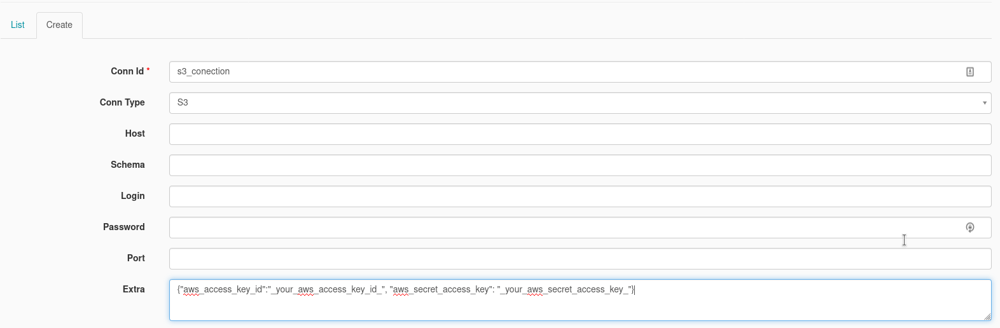

# subir contenedores
cd /home/ec2-user/images/docker-airflow-custom/docker-airflow
docker-compose -f docker-compose-CeleryExecutor.yml down
docker-compose -f docker-compose-CeleryExecutor.yml up -d
docker start metabase
# tener configuracion conexion ssh y repo airflow custom

cd ~
mkdir dowload_files
cd dowload_files
git clone https://github.com/alexgrajales/uploads_files.git
source /home/ec2-user/venv/move_files/bin/activate
cd uploads_files/
pip install -r requirements.txt
vi settings.py
(echo "access_key=''"; echo "secret_key=''"; echo "bucket='nombrebukect'") > settings.py

colocar lo siguiente
access_key=''
secret_key=''
bucket='nombrebukect'

# crear usuario aws
Ir a aws y crear usuario guardar nombre access key y secret key y colocar los datos en el paso anterior

# crear buecket
Ir a aws y crear un bucker y colocar el nombre en el paso anterior

#crear dag
crear dag 

# crear variables airflow
crear variables en airflow
bucket="name_bucket"

#crear conexion
nombre=s3_conection
tipo=s3
extra={"aws_access_key_id":"_your_aws_access_key_id_", "aws_secret_access_key": "_your_aws_secret_access_key_"}

#configurara cli aws
configurar aws cli en el servidor https://docs.aws.amazon.com/cli/latest/userguide/cli-configure-files.html
mkdir .aws
cd .aws
(echo "[default]"; echo "aws_access_key_id="; echo "aws_secret_access_key=") > credentials
(echo "[default]"; echo "region=us-west-2"; echo "output=json") > config
vi credentials
[default]
aws_access_key_id=
aws_secret_access_key=

vi config
[default]
region=us-west-2
output=json

probar con
aws s3 ls

#revisar si se tiene cliente de postgres en la instancia https://unix.stackexchange.com/questions/571415/postgres-install-on-amazon-linux
psql --version
si no se tiene seguir los pasos del vinculo e instalarlo

#crear tabla
crear tabla en sandbox 

CREATE TABLE sandbox.data_covid (
    "fecha reporte web" varchar(100),
    "ID de caso" varchar(100),
    "Fecha de notificación" varchar(100),
    "Código DIVIPOLA departamento" varchar(100),
    "Nombre departamento" varchar(100),
    "Código DIVIPOLA municipio" varchar(100),
    "Nombre municipio" varchar(100),
    "Edad" varchar(100),
    "Unidad de medida de edad" varchar(100) ,
    "Sexo" varchar(100),
    "Tipo de contagio" varchar(100),
    "Ubicación del caso" varchar(100),
    "Estado" varchar(100),
    "Código ISO del país" varchar(100),
    "Nombre del país" varchar(100),
    "Recuperado" varchar(100),
    "Fecha de inicio de síntomas" varchar(100),
    "Fecha de muerte" varchar(100),
    "Fecha de diagnóstico" varchar(100),
    "Fecha de recuperación" varchar(100),
    "Tipo de recuperación" varchar(100),
    "Pertenencia étnica" varchar(100),
    "Nombre del grupo étnico" varchar(100)
);

CREATE TABLE sandbox.data_ciudades (
    "Código Departamento" varchar(100),
    "Nombre Departamento" varchar(100),
    "Código Municipio" varchar(100),
    "Nombre Municipio" varchar(100)
);

CREATE TABLE sandbox.data_covid_uci_bogota(
    "Fecha" varchar(1000),
    "Camas UCI ocupadas Covid-19" varchar(1000),
    "Total camas UCI COVID 19 reportadas por IPS" varchar(1000),
    "Ocupación UCI COVID 19" varchar(1000)
);

#implementar dag

#pruebas

# correcion de profile en dbt una sola base de datos con dos shcemas 

# abrir puerto 8001 en la instancia
ejecutar 
dbt docs generate --vars "{'schema': 'sandbox'}"
nohup dbt docs serve --port 8001